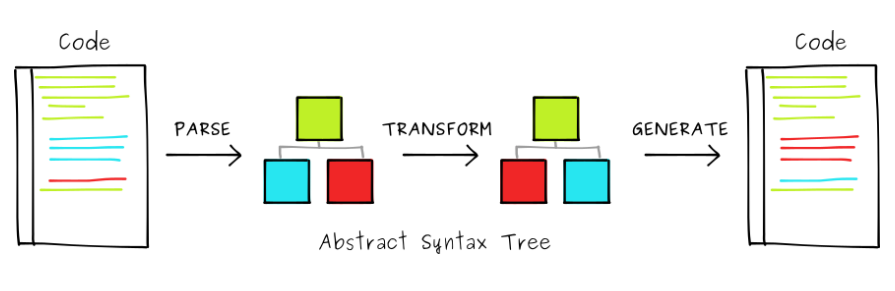

import { Head, Notes } from "mdx-deck";
import { Invert } from "mdx-deck/layouts";
import { Image } from "mdx-deck";
import { CodeSurfer, SurferSplit } from "mdx-deck-code-surfer";
import { Split } from "mdx-deck/layouts";

import codeSurferTheme from "prism-react-renderer/themes/dracula";

<Head>
  <title>Transpiling: a quick journey from Python to Python</title>
</Head>

# Transpiling: a quick journey from Python to Python

---

export default Split;

## Daniele Esposti

Senior Python Developer

---

## Compilation

The action of translating source code into machine code

---

## Example:

The classing "Hello, World!" in C

---

<CodeSurfer
  title="hello.c"
  theme={codeSurferTheme}
  language="c"
  code={require("!raw-loader!./snippets/hello.c").default}
/>

---

<CodeSurfer
  title="hello.asm"
  theme={codeSurferTheme}
  code={require("!raw-loader!./snippets/hello.asm").default}
/>

---

<CodeSurfer
  title="hello.bin"
  theme={codeSurferTheme}
  code={require("!raw-loader!./snippets/hello.bin").default}
/>

---

## Note

Assembly and binary can vary between different

**compilers**, **version** of the compilers and **architectures**.

But this is a story for another day :-)

---

## By generalisation

Compilation is the process of translating

a language (**source code**)

into another language (**machine code**)

---

## ..or..

**source code** into another **source code**

---

## Transpilation

Transpilation or source-to-source compilation

is the process of translating

source code into source code

of the same or different language

---

A well-know and popular transpiler

---

<Image src="assets/babel.jpg" />

---

<CodeSurfer
  theme={codeSurferTheme}
  language="javascript"
  code={require("!raw-loader!./snippets/babel_example.js").default}
/>

---

## Actual steps for the transpilation process

---

---

## Tokenisation

converts the code into tokens

a token is a string representing a keyword, variable name, value, etc.

---

## Parsing

Matching tokens against the language's grammar

and producing an AST

---

## Transformation

Applies multiple transformations to the AST

to match the grammar and features

of the target language

---

## Generation

Convert the transformated AST into source code

---

<!-- Transpilation process in Python -->

## Astor

A package to convert Python code into AST

and AST into Python code

---

<CodeSurfer
  theme={codeSurferTheme}
  language="python"
  code={require("!raw-loader!./snippets/astor_parse_generate.py").default}
  steps={[
    { notes: "" },
    { lines: [4], notes: "Parse code into AST" },
    { range: [5, 13], nodes: "Code is now a tree of nodes" },
    { lines: [15], notes: "Convert back the AST into source code" },
    { lines: [16], notes: "Here our original source code" }
  ]}
/>

---

## How to implement transformations

- subclass `astor.tree_walk.TreeWalk`
- use `init_*`, `pre_*` and `post_*` for node-specfic actions
- pass the AST to the class' constructor

---

## A simple transformer

Remove all the annotations from assignments

---

<CodeSurfer
  theme={codeSurferTheme}
  code={require("!raw-loader!./snippets/strip_annotations_map.txt").default}
/>

---

## Anatomy of an assignment

---

<CodeSurfer
  theme={codeSurferTheme}
  code={
    require("!raw-loader!./snippets/assignment_anatomy_with_types.txt").default
  }
  steps={[
    { notes: "" },
    {
      lines: [2, 6, 10],
      notes: "Assignment instruction is the AnnAssign node"
    },
    {
      tokens: { 2: [0] },
      lines: [7],
      notes: "Variable name is a Name node"
    },
    {
      tokens: { 2: [2] },
      lines: [8],
      notes: "Variable's type is a Name node as well"
    },
    {
      tokens: { 2: [3] },
      notes: "Assignment operator is implicit in the AnnAssign node"
    },
    {
      tokens: { 2: [5] },
      lines: [9],
      notes: "Variable's value is the Num node"
    }
  ]}
/>

---

<CodeSurfer
  theme={codeSurferTheme}
  code={
    require("!raw-loader!./snippets/assignment_anatomy_no_types.txt").default
  }
  steps={[
    { notes: "" },
    { lines: [2, 6, 9], notes: "Assignment instruction now is Assign node" },
    { tokens: { 2: [0] }, lines: [7], notes: "Variable's name" },
    { tokens: { 2: [3] }, lines: [8], notes: "Variable's value" }
  ]}
/>

---

<CodeSurfer
  theme={codeSurferTheme}
  language="python"
  code={
    require("!raw-loader!./snippets/transform_strip_annotations.py").default
  }
  steps={[
    { notes: "" },
    { lines: [3, 6], notes: "Inherit form TreeWalk" },
    {
      lines: [7],
      notes: "Calls method on starting before visiting AnnAssign node"
    },
    {
      lines: [8, 9],
      notes: "Create a new Assign node out of AnnAssign fields"
    },
    { lines: [12], notes: "Replace AnnAssign node with Assign" }
  ]}
/>

---

## The pypytranspy project

a platform to write an apply transformations

Open Source on Github

https://github.com/expobrain/pypytranspy/

---

## What we can do with a transpiler?

- use latest language's features and run on an older interpreter
- migrate code to the next version of the language
- automate code updates on medium to large codebase
- custom code refactoring
- code generation
- debug code removal

---

# Thank you!

  
  @expobrain

  
  https://github.com/expobrain

---

# Q&A time!
